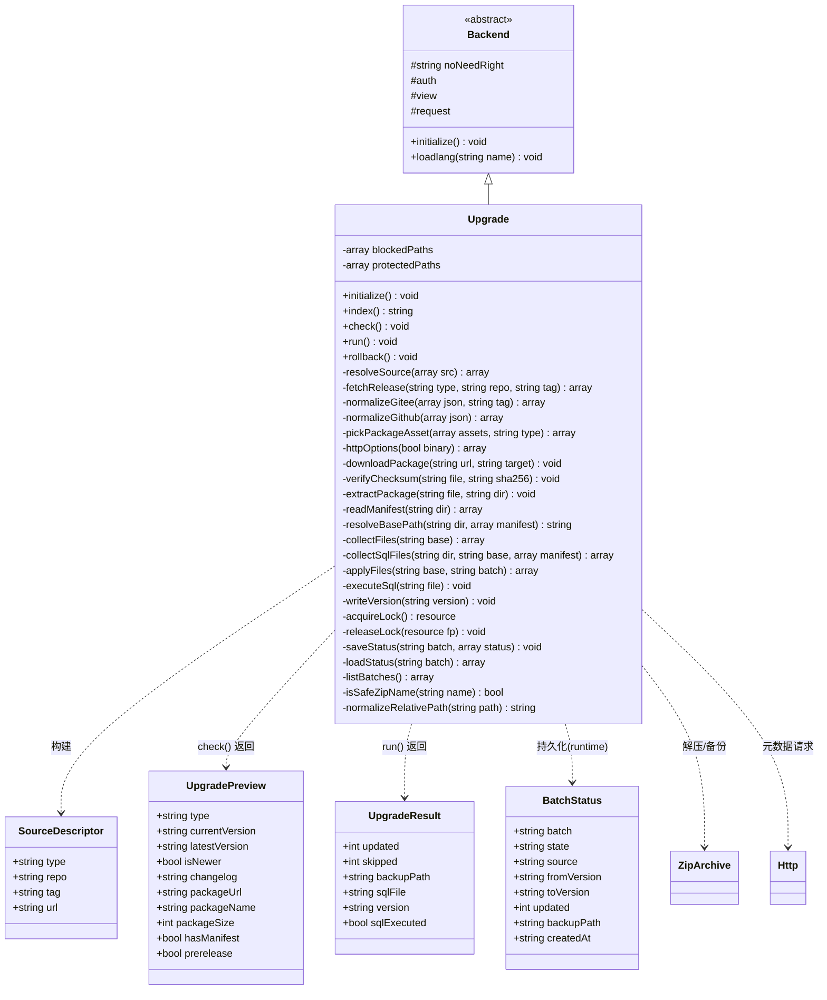
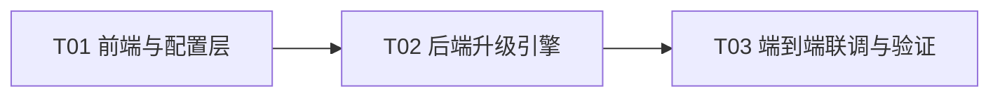

# RocketAdmin 系统升级功能完善 — 架构设计方案

> 范围：为已存在的 `app/admin/controller/Upgrade.php`（ThinkPHP 6 + FastAdmin 风格后台）补齐"可用、闭环"的在线升级能力。
> 目标形态：**最小化新增文件、不建表、不引入新依赖**，来源支持 GitHub / Gitee Release，并为后续自建源预留扩展点。
> 所有结论基于逐文件实测（见团队盘点 G1–G16），未实测项在"待明确事项"中标注。

---

## Part A：系统设计

### 1. 实现方案（Implementation Approach）

#### 1.1 核心技术难点

| 难点 | 说明 | 处理策略 |
|------|------|----------|
| 多来源归一 | GitHub/Gitee Release 字段不同、Gitee 无 size、asset 形态不同 | 控制器内 `resolveSource()` 归一化为统一 preview 结构，`type` 分支处理 |
| 无 manifest 的整包快照 | Gitee 免费版实测 asset 是按 tag 生成的源码快照 zip（`/archive/refs/tags/<tag>.zip`），**不含 manifest.json** | 兼容"托管包（有 manifest）/ 快照包（无 manifest）"两种形态，快照包走"整包覆盖 + 保护清单 + 二次确认" |
| 高危落盘的安全 | 升级动作会覆盖项目根目录文件 | checksum 校验 + 路径穿越校验 + 环境私有文件保护 + 备份 + 可回滚 + 并发锁 |
| TLS 校验 | 本机 `openssl.cafile`/`curl.cainfo` 均为空，直接开 `verify_peer=true` 会失败 | 引入 `verify_tls` + `ca_file` 配置，**不静默关闭**，失败给可读提示 |
| 大包内存 | `memory_limit=256M`，原实现全量 `file_get_contents` 入内存 | 下载改为 curl 流式落盘（`CURLOPT_FILE`） |
| 可观测 | 升级后无版本、无日志、无批次记录 | 版本写回 `config/rocket.php` + `runtime/upgrade/<batch>/status.json` |

#### 1.2 框架与依赖选择

- **不新增任何第三方依赖**：无 composer 包、无前端库。
- 架构模式沿用项目既有 **FastAdmin MVC**：
  - 后端：`Backend` 基类控制器（`app/common/controller/Backend.php`）+ ThinkPHP facade（`Config`/`Db`）。
  - 前端：Think 模板（`app/admin/view/upgrade/index.html`）+ requireJS 前端 Controller（`public/assets/js/backend/upgrade.js`，导出 `{index, check, run, rollback}`），与 `addon.js` 完全同构。
- 复用既有资产（**不重复造轮子**）：

| 资产 | 复用点 |
|------|--------|
| `extend/util/Http.php` | 取 Release 元数据 JSON（可传 `$options` 覆盖 UA/timeout/SSL；用 `sendRequest()` 拿 `errno/msg` 以生成可读错误） |
| PHP 原生 `curl` | **二进制包下载**（`util\Http` 固定 `RETURNTRANSFER=true`，无法流式落盘） |
| `ZipArchive` | 解压 + 路径穿越校验（沿用现有 `isSafeZipName`） |
| `app/common.php` | `is_really_writable()`、`var_export_short()`、`rmdirs()`、`format_bytes()`、`__()` |
| `InstallService` | **仅对齐写法**：`refreshTokenKey()/syncSiteConfig()` 的"`include` 配置 → 改键 → `var_export_short` 回写"模式，用于版本号写回 |
| 现有 `Upgrade.php` | 保留并增强其 `download/extract/readManifest/resolveBasePath/collectSqlFiles/copyUpgradeFiles/isSafeZipName/normalizeRelativePath` 等私有方法 |

> **裁决（上游 `RemoteUpgradeService`）**：`E:\phpstudy_pro\extraproject\tp8-fastadmin\app\common\service\RemoteUpgradeService.php` 全仓无调用方（死代码），且不在本项目内。**不搬入、不新建同类文件**；仅**对齐其思路**（`class_exists(ZipArchive)` 前置检查、`verifyChecksum` 用 `hash_equals`+sha256、`splitSql` 去 `--` 注释按 `;` 切、`isPathInside` 路径包含校验、`skipPaths` 保护清单），把这些能力**就地实现在 `Upgrade.php` 控制器内**。

---

### 2. 文件清单（File List）

| 类型 | 相对路径 | 动作 | 说明 |
|------|----------|------|------|
| 后端 | `app/admin/controller/Upgrade.php` | **修改** | 现有 311 行控制器原地增强：多源解析、预检、流式下载、checksum、锁、状态、版本写回、回滚 |
| 配置 | `config/rocket.php` | **修改** | 新增 `upgrade` 子配置；`version` 键保留为"项目版本号" |
| 视图 | `app/admin/view/upgrade/index.html` | **新增** | 页面骨架（自带 `<style>`，不改 skins/bootstrap/fastadmin.css） |
| 前端 | `public/assets/js/backend/upgrade.js` | **新增** | 前端 Controller，导出 `{index, check, run, rollback}` |
| 语言 | `app/admin/lang/zh-cn/upgrade.php` | **新增** | 全部 `__()` 词条 |
| 数据 | `im_auth_rule` 新增 1 条菜单节点 | **数据操作（SQL）** | 让页面可被侧边栏访问（**非建表/非改表结构**，属必需数据） |
| 产物 | `runtime/upgrade/<batch>/{package.zip,extract/,backup/,status.json,files.json}` | 运行期生成 | 批次工作目录（不入版本库） |

> 合计：**修改 2 个既有文件 + 新增 3 个文件 + 1 条菜单数据**。无新表、无新 ORM 模型、无新依赖。

---

### 3. 数据结构与接口（Data Structures & Interfaces）

#### 3.1 类图



#### 3.2 关键接口签名（供工程师实现，仅列签名与返回结构）

**控制器 action（HTTP 接口）**

| 方法 | 入参 | 返回（`$this->success/error` 的 data） |
|------|------|----------------------------------------|
| `index()` | — | 渲染页面，assign `currentVersion`、`upgradeConfig`(脱敏)、`batches`(最近批次) |
| `check()` | POST `type`/`repo`/`tag`/`url` | `UpgradePreview`（见下） |
| `run()` | POST `type`/`repo`/`tag`/`url`/`confirm` | `UpgradeResult` |
| `rollback()` | POST `batch` | `{restored:int, version:string, batch:string}` |

```php
// UpgradePreview 结构（check 返回 data）
[
  'type'           => 'gitee|github|url',
  'current_version'=> '1.6.1.20250430',
  'latest_version' => '1.7.0',
  'is_newer'       => true,          // version_compare(latest, current, '>')
  'prerelease'     => false,
  'changelog'      => '...',         // body，纯文本
  'package_url'    => 'https://...',
  'package_name'   => 'v1.7.0.zip',
  'package_size'   => 123456,        // int|null（Gitee 无 size 时为 null，前端容错）
  'has_manifest'   => false,         // url 直连 manifest 时已知；否则前端提示"包内解析"
  'asset_choices'  => [ /* 可选：多 asset 时供用户改选 */ ],
]

// UpgradeResult 结构（run 返回 data）
[
  'updated'      => 42,
  'skipped'      => 7,
  'backup_path'  => 'runtime/upgrade/20250601_101010/backup',
  'sql_file'     => 'runtime/upgrade/20250601_101010/upgrade.sql', // 空串=无 SQL
  'sql_executed' => false,
  'version'      => '1.7.0',
  'batch'        => '20250601_101010',
]

// BatchStatus（runtime/upgrade/<batch>/status.json）
[
  'batch' => '20250601_101010', 'state' => 'running|done|failed|rolled_back',
  'source' => 'gitee:owner/repo', 'from_version' => '1.6.1', 'to_version' => '1.7.0',
  'updated' => 42, 'backup_path' => '...', 'created_at' => '2025-06-01 10:10:10',
]
```

**新增配置（`config/rocket.php`）**

```php
'upgrade' => [
    'enabled'      => true,                        // 是否开放后台升级入口
    'source'       => 'gitee',                     // 默认源类型 github|gitee|url
    'github_repo'  => '',                          // owner/repo
    'gitee_repo'   => '',                          // owner/repo
    'source_url'   => '',                          // 自建源：manifest.json 或 直接 zip 地址
    'token'        => '',                          // 可选：GitHub/Gitee Token（私有库/提配额）
    'verify_tls'   => true,                        // 是否校验 TLS
    'ca_file'      => '',                          // 自定义 CA bundle；空则用系统默认
    'github_api'   => 'https://api.github.com',    // 便于本地 mock 验证
    'gitee_api'    => 'https://gitee.com/api/v5',  // 便于本地 mock 验证
    'execute_sql'  => false,                       // 升级后是否自动执行 SQL（默认否）
    'keep_batches' => 5,                           // 保留最近 N 个批次（0=不清理）
],
```

> `version` 键保持原样（`1.6.1.20250430`），语义见 §7「版本号归属」。原 `index()` 引用的 `rocket.upgrade_url` 全项目仅此一处引用（已 grep 确认），本次一并移除。

**前端 Controller 结构（`upgrade.js`）**

```js
define(['jquery','bootstrap','backend','form'], function ($, undefined, Backend, Form) {
    var Controller = {
        index:    function () { /* 绑定检查/升级/回滚按钮 + 渲染 preview */ },
        check:    function () { /* _empty：非页面 action，仅占位 */ },
        run:      function () {},
        rollback: function () {},
        api: { bindevent: function () { Form.api.bindevent($("form[role=form]")); } }
    };
    return Controller;
});
```

---

### 4. 需要补充的模块 —— 5 个候选逐个裁决

> 裁决原则：**YAGNI**，不为凑模块造抽象；"不需要"的必须给出触发条件。

| 候选 | 裁决 | 载体 | 理由 | 什么条件下才需要 |
|------|------|------|------|------------------|
| **服务层** | **不需要新建 Service 文件** | 能力就地实现在 `Upgrade.php` | ① 唯一调用方是本控制器，抽出去只是"搬家"；② 上游 `RemoteUpgradeService` 是死代码，搬入=新增文件且违反铁律；③ 控制器已具备全套下载/解压/备份/覆盖能力 | 出现**第二个调用方**时：如新增 CLI `php think upgrade`（无人值守升级）、安装向导 `Install` 复用同一套包校验/落盘、或新增前台/API 触发升级。届时把"包处理引擎"抽到 `app/common/service/UpgradeService.php` |
| **数据模型（ORM）** | **不需要** | 无 | ① 铁律禁止建表/加 ORM；② 升级无需持久实体；③ `im_version` 表是"移动端 App 版本发布"，语义无关，禁止误用 | 当需要**可 SQL 查询的升级审计/多节点同步状态/回滚记录检索**时，才建表 + `app/common/model/UpgradeLog.php` |
| **接口** | **需要** | `Upgrade` 控制器新增 action：`check/run/rollback` | 页面渲染、预览、执行、回滚都需要独立 HTTP 端点；FastAdmin 约定即 action 即接口 | — |
| **持久化** | **需要，但用文件不用 DB** | `runtime/upgrade/<batch>/{status.json,files.json,backup/}` + 版本写回 `config/rocket.php` | runtime 天然可写、已存在、不入版本库；不建表即可闭环 | 需跨节点共享升级状态时改用 DB |
| **状态管理** | **需要（两层，均不引入框架）** | 前端：`upgrade.js` Controller（既有 requireJS 模式）；后端：`status.json`(状态机) + `upgrade.lock`(flock 单飞) | 升级是多步长流程，需"进行中/完成/失败/已回滚"状态以支撑回滚与并发控制 | 需要并发编排/断点续传/队列时再引入任务队列 |

---

### 5. 模块间依赖与数据流转

```mermaid
graph TD
    UI["view/upgrade/index.html<br/>+ js/backend/upgrade.js"] -->|Fast.api.ajax| C["Upgrade 控制器"]
    C -->|读默认源| CFG["config/rocket.php"]
    C -->|元数据 GET| API["GitHub/Gitee Release API<br/>(经 util\\Http)"]
    C -->|二进制流式下载| PKG["远程升级包 .zip<br/>(原生 curl)"]
    C -->|解压/校验| ZIP["ZipArchive"]
    C -->|备份/覆盖| ROOT["项目根目录文件"]
    C -->|批次/状态/锁| RT["runtime/upgrade/*"]
    C -->|版本写回| CFG
    C -->|执行 SQL(可选)| DB["MySQL"]
    RT -.回滚数据源.-> C

    subgraph 保护
        ROOT -. 跳过/保护 .-> ENV[".env / .git/ / runtime/ /<br/>public/uploads/ / config 环境私有文件"]
    end
```

**数据流转（run 主链）**：
`前端参数` → `SourceDescriptor` → `远程 Release JSON` → `UpgradePreview` → `package.zip`（流式） → `sha256 校验` → `extract/` → `manifest/基准目录` → `文件清单 + SQL 清单` → `backup/ + files.json` → `覆盖根目录` → `写回 version` → `落盘 SQL` → `status.json` → `UpgradeResult`。

---

### 6. 关键处理流程

#### 6.1 预检 `check`（只取元数据，不下载整包）

1. `initialize()` 已强制超管（沿用）。
2. 读入 source 描述（`type/repo/tag/url`），缺省回退 `config/rocket.php` 的 `upgrade` 默认值。
3. URL 合法性校验（`isValidRemoteUrl`，仅 http/https）。
4. `resolveSource()`：按 `type` 分支
   - `gitee`：GET `{gitee_api}/repos/{repo}/releases/latest`（指定 tag 则 `/tags/{tag}`）。
   - `github`：GET `{github_api}/repos/{repo}/releases/latest`，**必须带 `User-Agent`**（否则 403），可选 `Authorization: Bearer {token}`。
   - `url`：GET 该地址；以 `.zip` 结尾 → 视为包；否则按 manifest JSON 解析。
5. 归一化：`normalizeGitee/normalizeGithub` 提取 `tag_name/name/body/prerelease/assets`；`pickPackageAsset` 选包（优先 `.zip` asset；Gitee 快照优先 `/archive/refs/tags/` 的 `.zip`；GitHub 无 asset 时回退 `zipball_url`）。
6. 版本比较：`version_compare(ltrim(tag,'v'), current, '>')` → `is_newer`（**不用 `util\Version::check`，它是集合匹配器不是新旧比较器**）。
7. 返回 `UpgradePreview`。

#### 6.2 执行 `run`

1. 超管 + POST 校验。
2. **并发锁**：`flock(runtime/upgrade/upgrade.lock, LOCK_EX|LOCK_NB)`；失败 → "已有升级在进行"。
3. 复跑 `resolveSource()` 得到 `package_url` + 期望 checksum。
4. 建批次目录 `runtime/upgrade/<YmdHis>/`，写 `status.json`(state=running)。
5. **流式下载**：原生 curl `CURLOPT_FILE` 写 `package.zip`（解决 OOM）。
6. 校验：非空 + `class_exists(ZipArchive::class)`（缺失→可读提示，解决白屏）+ 扩展名。
7. `verifyChecksum()`（源提供 sha256 时用 `hash_equals` 校验）。
8. `extractPackage()`：路径穿越校验（`isSafeZipName`）→ 解压。
9. `readManifest()`（可能为空 = 快照包）→ `resolveBasePath()` → `collectFiles()` + `collectSqlFiles()`。
10. **空包检测**：文件清单为空 → 报错"包内无可覆盖文件"（解决静默成功）。
11. `applyFiles()`：逐文件备份到 `backup/<相对路径>` 并写 `files.json`，再覆盖根目录；跳过 `blockedPaths`，保护 `protectedPaths`。
12. `writeVersion()`：写回 `config/rocket.php` 的 `version`。
13. SQL：`execute_sql=false` 时**只落盘** `runtime/upgrade/<batch>/upgrade.sql`（**不再污染项目根目录**）；为 true 时逐条 `Db::execute`，失败置 state=sql_failed 并提示可回滚。
14. 写 `status.json`(state=done) → 释放锁 → `success(UpgradeResult)`。

#### 6.3 回滚 `rollback`

1. 超管 + POST，参数 `batch`（批次号；缺省取最近一次 done 批次）。
2. 校验批次存在且 `backup/` 非空。
3. 获取升级锁。
4. 从 `backup/` 递归复制回项目根目录（覆盖）。
5. 从 `status.json` 读 `from_version` → `writeVersion()` 还原。
6. 写 `status.json`(state=rolled_back) → 释放锁 → `success`。

> **回滚边界（必须写进 UI 提示）**：只还原"被覆盖过的旧文件"；升级**新增**的文件不在 backup 中，**默认不删除**（避免误删用户数据）。

---

### 7. 异常与边界处理策略

| # | 场景 | 策略 |
|---|------|------|
| 1 | 源不可达 / 超时 | `Http::sendRequest` 取 `errno/msg`；连接 10s、总 30s；提示"源不可达/超时" |
| 2 | 仓库不存在（Gitee 返回 `Not Found Project`） | 识别 `message` 字段 → "仓库不存在或无权限" |
| 3 | 无 Release（404） | "该仓库暂无 Release" |
| 4 | 无 asset | 回退 `zipball_url`(GitHub) / 提示 Gitee 无附件；仍无 → "未找到可下载的升级包" |
| 5 | JSON 非法 | `json_decode` 失败 → "源返回内容不是有效 JSON" |
| 6 | 包非 zip | `ZipArchive::open` 非 true → "不是有效的 ZIP 文件" |
| 7 | 路径穿越 | `isSafeZipName` + `normalizeRelativePath` 拒绝 `../`、绝对路径、盘符 |
| 8 | 空包 | 文件清单为空 → 报错（不再静默成功） |
| 9 | 缺 manifest（快照包） | 走"整包覆盖"分支：展示覆盖/保护清单，需 `confirm=1` 二次确认 |
| 10 | SSL 校验失败 | `verify_tls=true` 时若失败 → 明确提示"配置 `ca_file` 或确认后关闭校验"；**不静默关闭** |
| 11 | checksum 不匹配 | `hash_equals` 失败 → 中止，不落盘 |
| 12 | 磁盘/权限不足 | 覆盖前 `is_really_writable` 预检目标目录；失败给路径级提示 |
| 13 | 备份中途失败 | 抛异常并置 state=failed；**先备份后覆盖**，未覆盖前可安全放弃 |
| 14 | 覆盖到一半失败 | 中止并置 failed；提供 `rollback` 还原已覆盖文件 |
| 15 | 并发升级 | `flock` 非阻塞锁；占用则直接拒绝 |
| 16 | SQL 执行失败 | 置 state=sql_failed，返回已执行的语句位置，提示人工处理/回滚 |
| 17 | 版本号写回失败 | `is_really_writable(config/rocket.php)` 预检；失败提示但**不阻断**已完成的文件升级 |
| 18 | PHP 扩展缺失 | `class_exists(ZipArchive::class)` 前置检查；控制器边界 `catch (\Throwable)`（兼容 PHP8 `Error` 不继承 `Exception`） |
| 19 | 超时/内存 | 下载流式落盘；`set_time_limit(0)` + `ini_set('memory_limit', ...)` 兜底 |
| 20 | 批次堆积 | 按 `keep_batches` 清理最旧批次（`rmdirs()`） |
| 21 | SSRF（指向内网/元数据地址） | 超管门控 + 可选内网地址黑名单（`127.0.0.1`/`169.254.*`/`10.*` 等，待确认） |
| 22 | GitHub 字段未实测 | 全部按"字段缺失不致命"容错（`?? ''` / `?? []`） |

---

### 8. 分阶段实施步骤与验证方式

> 本机**无法访问 `api.github.com`**（代理拦截，curl 返回 0 字节），故验证一律使用**本地 mock 源**，不依赖真实 GitHub。

#### 阶段 P1：打通可达性（结构性缺口 G1–G5）

- **改动**：`config/rocket.php`（新增 `upgrade` 配置）、`app/admin/view/upgrade/index.html`（新建）、`public/assets/js/backend/upgrade.js`（新建，先出 `index` 骨架）、`app/admin/lang/zh-cn/upgrade.php`（新建）、`im_auth_rule` 新增菜单节点。
- **菜单 SQL**（唯一数据操作，非建表）：
  ```sql
  INSERT INTO `im_auth_rule`
    (`type`,`pid`,`name`,`title`,`icon`,`url`,`condition`,`remark`,`ismenu`,`menutype`,`extend`,`weigh`,`status`,`createtime`,`updatetime`)
  VALUES
    ('file',0,'upgrade','系统升级','fa fa-cloud-download','upgrade/index','','后台系统升级',1,'addtabs','',100,'normal',UNIX_TIMESTAMP(),UNIX_TIMESTAMP());
  ```
  执行后清理菜单缓存：`Cache::delete('__menu__')`（或后台右上角"刷新"）。
- **验收**：
  - `php -l app/admin/controller/Upgrade.php`、`php -l app/admin/lang/zh-cn/upgrade.php` 均无错误。
  - 模板离线渲染（PHP CLI）无语法错误、`{:__('...')}` 正常输出。
  - 访问 `/admin/upgrade/index` 返回 200 且显示当前版本；侧边栏出现"系统升级"入口。
  - 直连 MySQL 校验：`SELECT id,name,url FROM im_auth_rule WHERE name='upgrade';` 返回 1 行。

#### 阶段 P2：多源解析与预检（G4、G16 + 源契约）

- **改动**：`Upgrade.php` 新增 `resolveSource/fetchRelease/normalizeGitee/normalizeGithub/pickPackageAsset/check`；`upgrade.js` 补 `check` 交互；语言包补词条。
- **验收**（本地 mock）：
  - 起 mock 源：`php -S 127.0.0.1:8899 -t <tempdir>`，提供 `/repos/{owner}/{repo}/releases/latest`（分别放 gitee 风格与 github 风格 JSON）。
  - 将 `rocket.upgrade.gitee_api/github_api` 指向 mock，点击"检查更新"返回 `UpgradePreview`。
  - 错误分支逐一验证：404 / `{"message":"Not Found Project"}` / 无 asset / 非法 JSON 均给出可读提示。
  - `version_compare` 判断 `v1.7.0 > 1.6.1` 为真。

#### 阶段 P3：执行闭环（G6–G9、G11–G15）

- **改动**：`Upgrade.php` 增强 `downloadPackage/verifyChecksum/extractPackage/applyFiles/writeVersion/executeSql/acquireLock/saveStatus`；`upgrade.js` 补 `run`。
- **验收**（本地 mock + 真实 zip）：
  - mock 提供含 `manifest.json`+`app/...`+`sql/upgrade.sql` 的 `pkg.zip`，并给 `sha256`。
  - 跑 `run`：文件被覆盖、`backup/` 生成、checksum 校验通过、`config/rocket.php` 版本写回、`status.json=done`、SQL 落盘到批次目录（不落根目录）。
  - 反向用例：改坏 sha256 → 中止且不落盘；空包 → 报错；`im_auth_rule` 无影响；并发再点 → 被锁拒绝；临时改名 zip 扩展 → 可读提示（非白屏）。
  - `grep version config/rocket.php` 显示新版本。

#### 阶段 P4：回滚与批次 + 收尾（G10）

- **改动**：`Upgrade.php` 新增 `rollback/listBatches/loadStatus`；`upgrade.js` 补 `rollback` + 批次列表；`index()` assign `batches`。
- **验收**：
  - run 后 rollback：文件还原为旧内容、`config/rocket.php` 版本还原、`status.json=rolled_back`。
  - `ls runtime/upgrade/<batch>/` 可见 `backup/ files.json status.json`。
  - 超过 `keep_batches` 时最旧批次被清理。

---

### 9. 待明确事项（Anything UNCLEAR）

1. **默认源地址**：项目自身的 GitHub/Gitee `owner/repo` 是什么？无此值页面无法开箱即用。
2. **Release 包形态**：是发布"托管包（含 manifest.json + checksum）"还是直接用 tag 源码快照？决定安全模型强度（快照包=整包覆盖）。
3. **是否默认执行 SQL**：默认 `false`（落盘待人工确认）。是否改为自动执行？
4. **CA 证书策略**：是否在 `config/rocket.php` 填 `ca_file`？本机 `openssl.cafile`/`curl.cainfo` 为空，需显式配置。
5. **是否允许关闭 TLS 校验**：默认 `verify_tls=true`。
6. **回滚是否删除"升级新增的文件"**：默认否（避免误删）。
7. **是否需要升级历史持久化到 DB**：默认文件；若需审计再建表。
8. **自建源契约**：是否沿用 `manifest.json`（`package_url/checksum/sql_url/changelog/version`）字段？
9. **GitHub 字段未实测**：需真实网络复核 `assets[].size` 等。
10. **菜单 `name` 命名约定**：`upgrade` 是否与项目既有命名一致（建议在"权限管理→菜单规则"页确认后落库）。
11. **是否加内网地址（SSRF）黑名单**。

---

## Part B：任务分解

### 10. 依赖包（Required Packages）

**无需新增任何第三方依赖。** 运行期复用既有能力：

```
- thinkphp/framework  (项目已有): Config/Db facade
- ext-zip            (环境已装 ✓): ZipArchive
- ext-curl           (环境已装 ✓): 流式下载
- ext-openssl        (环境已装 ✓): TLS/CA
- util\Http          (项目已有): Release 元数据请求
- app\common 全局函数 (项目已有): is_really_writable / var_export_short / rmdirs / format_bytes / __
```

### 11. 任务清单（按依赖排序）

| 任务 | 名称 | 涉及文件 | 依赖 | 优先级 |
|------|------|----------|------|--------|
| **T01** | 前端与配置层（打通可达性） | `config/rocket.php`、`app/admin/view/upgrade/index.html`、`public/assets/js/backend/upgrade.js`、`app/admin/lang/zh-cn/upgrade.php`、`im_auth_rule` 菜单 SQL | — | P0 |
| **T02** | 后端升级引擎（源解析 + 预检 + 执行 + 回滚） | `app/admin/controller/Upgrade.php` | T01 | P0 |
| **T03** | 端到端联调与验证（mock 源 + 反向用例 + 清理） | 临时验证产物（不入库） | T02 | P1 |

> **关于"每任务≥3 文件"规则的说明**：T02/T03 仅触及单个后端控制器文件。这是本功能的客观形态——后端能力天然收敛在 `Upgrade.php` 一个控制器内（FastAdmin 约定），强行拆成"一文件一任务"反而**违反**"禁止一个文件一个任务"的同级规则。故此处**有意将后端引擎合并为 T02**，避免人为制造只含 1 个文件却相互线性依赖的碎片任务。总任务数 3（≤5），首任务为基础设施（T01）。

### 12. 共享知识（Shared Knowledge）

- 控制器响应统一走 FastAdmin `$this->success($msg,$url,$data)` / `$this->error($msg)`，前端用 `Fast.api.ajax` 解析。
- 所有用户可见文案走 `__()`，词条集中在 `app/admin/lang/zh-cn/upgrade.php`（缺失会退化为英文原文）。
- 时间：批次号 `date('YmdHis')`；展示 `date('Y-m-d H:i:s')`。
- 路径：一律 `str_replace('\\','/')` 归一化；用户/包内相对路径必须过 `normalizeRelativePath`。
- 权限：`initialize()` 强制 `isSuperAdmin()`；`$noNeedRight` 覆盖 `index/check/run/rollback`（权限由超管门控，无需为各 action 建 RBAC 节点）。
- 样式：页面样式只写在内联 `<style>`；**严禁改** `public/assets/css/skins/*.css`、`bootstrap.css`、`fastadmin.css`；如需全局 CSS，权重 ≤0,1,1 且不命中 `.btn`/`.text-*`。改 `.css` 才需 `php think min -m backend -r css`；改 `.html/.js/.php` 不需要。
- TLS：`verify_tls`/`ca_file` 控制；二进制包用原生 curl 流式，元数据用 `util\Http`。
- 版本号归属（见下）。

### 13. 版本号归属（重要）

| 版本号 | 来源 | 语义 | 升级后是否写回 |
|--------|------|------|----------------|
| `Config::get('rocket.version')`（当前 `1.6.1.20250430`） | `config/rocket.php` | **后台项目自身代码版本**（升级页/插件市场/静态资源 `?v=` 基准） | **是**（本功能核心） |
| `Config::get('site.version')`（当前 `1.0.2`） | `im_config` 表 `name='version'` | **前端站点静态资源缓存串**，由"常规配置"维护 | 否（语义无关，混用会误导） |
| `im_version` 表 | FastAdmin 自带 | **移动端 App 版本发布**（`oldversion/newversion/downloadurl`），服务 `app/api/controller/Common.php` | 否（与后台升级无关，禁止混用） |

### 14. 任务依赖图



---

## 附：缺口归类（对应团队盘点 G1–G16）

**结构性缺口（当前根本跑不起来）**：G1 缺视图、G2 缺 `upgrade.js`、G3 缺菜单节点、G4 缺 `upgrade_url` 配置、G5 缺语言包。

**逻辑缺口（能跑但闭环不成立）**：G6 不更新版本号、G7 无 checksum、G8 关闭 SSL 校验、G9 SQL 不执行、G10 无回滚、G11 无并发锁、G12 `ZipArchive` 未检查扩展、G13 空包静默成功、G14 下载全量入内存、G15 `collectSqlFiles` 过滤冗余、G16 无"先预览再升级"。

**补充缺口（本方案新增识别）**：
- G17 **SSRF**：任意 URL 无内网地址限制（超管门控降低风险，仍建议黑名单）。
- G18 **批次无清理**：`runtime/upgrade/*` 无限增长。
- G19 **SQL 落点污染根目录**：`writeSqlFile` 写到 `root_path()`，应改落批次目录。
- G20 **manifest 字段未做类型校验**（`files/sql/version` 类型）。
- G21 **无源描述概念**：无法区分来源类型，也无法展示更新日志/版本（并入 G16）。
- G22 **控制器边界 `catch (Exception)`**：PHP8 `Error`（如扩展缺失）抓不到 → 白屏（并入 G12，需改 `catch (\Throwable)`）。

---

## 附二：交付总监裁决与更正（本节优先于正文，冲突以本节为准）

### 裁决 1：菜单节点 SQL 采用项目既有写法

正文 §8 阶段 P1 给出的 `url='upgrade/index'` **不采用**。实测 `im_auth_rule` 中所有菜单行（`general`、`general.config`、`general.attachment` 等）的 `url` 字段**均为空串**，FastAdmin 由 `name` 推导 URL。改为与既有行完全一致的写法：

```sql
INSERT INTO `im_auth_rule`
  (`type`,`pid`,`name`,`title`,`icon`,`url`,`condition`,`remark`,`ismenu`,`menutype`,`extend`,`weigh`,`status`,`createtime`,`updatetime`)
VALUES
  ('file',0,'upgrade','系统升级','fa fa-cloud-download','','','后台系统升级',1,'addtabs','',100,'normal',UNIX_TIMESTAMP(),UNIX_TIMESTAMP());
```

回滚语句：`DELETE FROM im_auth_rule WHERE name='upgrade';`
缓存清理键 `__menu__`（实测于 `app/admin/controller/Addon.php:209`）。

### 裁决 2：不做 SSRF 内网黑名单

正文 §7 第 21 条与待明确第 11 条**裁决为不做**。理由：① 该入口已由 `initialize()` 的 `isSuperAdmin()` 强门控；② 黑名单会让**必需的本地 mock 端到端验证（`127.0.0.1:8899`）直接失败**，验证能力损失大于收益。若将来把该功能开放给非超管角色，再补黑名单。

### 裁决 3：新增配置项 `upgrade.proxy`（必需）

**实测结论**：本机环境存在 `http_proxy` / `https_proxy=http://127.0.0.1:54997`，libcurl 会**自动读取该环境变量**，导致访问本地 mock 源 `127.0.0.1:8899` 被送到代理并返回 **502**（PHP `file_get_contents` 与 `curl` 均复现）。因此：

- 新增配置 `'proxy' => ''`；
- 所有 curl 调用显式 `curl_setopt($ch, CURLOPT_PROXY, $proxy)`——显式设置（哪怕空串）会覆盖环境变量，本地验证与生产代理需求可同时满足。

### 裁决 4：控制器边界统一 `catch (\Throwable $e)`

正文 G22 落实为强制项。PHP 8 中 `Error` 不继承 `Exception`，`class_exists(ZipArchive::class)` 失败或 `new ZipArchive()` 抛错时，原 `catch (Exception)` 会漏接 → 白屏 500。

### 裁决 5：`$noNeedRight` 取值

`protected $noNeedRight = ['index', 'check', 'run', 'rollback'];` —— 权限由 `initialize()` 的超管校验统一门控，不为各 action 建 RBAC 节点。

### 裁决 6：`protectedPaths` 具体取值

正文只给了概念，实测后确定为**确实存在的三个环境私有配置**：`config/site.php`（安装向导生成）、`config/database.php`、`config/token.php`。`blockedPaths` 保留原 4 项：`.env`、`.git/`、`runtime/`、`public/uploads/`。

### 裁决 7：`config/rocket.php` 的 `upgrade_url` 移除

实测全项目仅 `app/admin/controller/Upgrade.php:36` 一处引用，随本次改造一并移除，避免留下死配置。

### 验证方式的环境约束（重要）

本机端到端验证一律使用**本地 mock 源**（`api.github.com` 实测可达，但真实仓库的 Release 形态不可控，故回归仍以 mock 为准）：

| 用途 | 地址 |
|------|------|
| 直链清单（自建源形态） | `http://127.0.0.1:8899/api/manifest.json` |
| Gitee 风格 Release | `http://127.0.0.1:8899/api/gitee/repos/demo/rocket-admin/releases/latest` |
| GitHub 风格 Release | `http://127.0.0.1:8899/api/github/repos/demo/rocket-admin/releases/latest` |
| 升级包 | `http://127.0.0.1:8899/pkgs/rocket-admin-1.7.0.zip` |
| 错误样本 | `.../repos/demo/{missing,norelease,noasset,badjson}/releases/latest` |

mock 包内含一个**故意的路径穿越条目 `../evil.php`**，用于验证解压前必须拒绝。

**覆盖测试必须在沙箱副本中进行**（复制项目到临时目录 + 沙箱内临时放行鉴权），**严禁直接对项目根目录跑 `run`**。

---

## 附三：实测更正（网络与下载层，本节**覆盖**正文 §1.1、§6.2、§7 的相关表述）

用户关闭代理后重做网络探测，以下均为**真实命令输出**，其中两项推翻了正文原设计。

### 更正 1（关键）：禁用 curl，下载改用 PHP stream 流式

正文 §1.1 写"下载改为 curl 流式落盘（`CURLOPT_FILE`）"，**不可用**。实测：

```
curl(默认):                     FAIL SSL certificate problem: unable to get local issuer certificate
curl(CURLOPT_PROXY=""):         FAIL SSL certificate problem: unable to get local issuer certificate
file_get_contents(默认上下文):   OK len=2294      ← 访问 https://api.github.com 成功
```

原因：本机 `curl.cainfo` 为空字符串，libcurl 找不到 CA 根证书。照原设计实现会导致升级功能**无法下载任何 HTTPS 包**。

替代方案（已实测通过，纯 stdlib，同时解决 G14 的 OOM）：

```php
$ctx = stream_context_create([
    'http' => ['timeout' => 300, 'user_agent' => 'RocketAdmin-Upgrader'],
    'ssl'  => ['verify_peer' => $verifyTls, 'verify_peer_name' => $verifyTls],
]);
$src = @fopen($url, 'rb', false, $ctx);
$dst = fopen($target, 'wb');
$n = stream_copy_to_stream($src, $dst);
```

实测输出：`stream_copy_to_stream: OK bytes=1775 sha256=81eaadf0840d956a46f1018adb92559129303afd5d21e8223a9e1a0022958174`（与 mock 包一致）。

### 更正 2：元数据请求也不要用 `util\Http`

`util\Http` 内部即 curl，同样受更正 1 影响。改用 `file_get_contents` + stream context（实测访问 GitHub **OK len=2294**）。正文 §1.2 复用表里"`extend/util/Http.php` 取 Release 元数据"一条**作废**。

### 更正 3：`upgrade.proxy` 的定位改变

实测 **PHP 的 http/https stream wrapper 不读取 `http_proxy` 环境变量**（访问本地 mock 与 GitHub 均直接成功，无需任何绕过）。因此：

- 本地验证**不需要**任何代理绕过；
- `upgrade.proxy` 保留，但实现改为写入 stream context 的 `'http' => ['proxy' => $proxy]`（仅非空时设置），用于生产环境经代理访问 GitHub。

（正文裁决 3 中"libcurl 自动读取 `http_proxy` 导致本地 502"的诊断**作废**——当时的 502 实为 mock 服务已停止 + `curl -o /dev/null` 在 Git Bash 下的写错误，属测量失误。）

### 更正 4：GitHub 源可"白拿" checksum —— G7 对 GitHub 源可零成本闭环

实测 `https://api.github.com/repos/cli/cli/releases/latest`：

```
assets[].digest = 'sha256:a6fd66c88e2f07d6e4e058173db341d07dd74d58cf8f19ae668293d2bb614ca3'
assets 总数 22 / digest 非空 22
```

`assets[].digest` 格式为 **`sha256:<64位hex>`**，且实测 **22/22 全部非空**。

→ 解析 GitHub asset 时剥掉 `sha256:` 前缀，作为期望 checksum 传入 `verifyChecksum()`。**用户无需额外发布带 checksum 的 manifest** 即可获得真实完整性校验。

→ Gitee 无此字段，checksum 只能来自 manifest；缺失时**跳过校验但必须如实提示**，不得假装已校验。

### 更正 5：GitHub `assets[].size` 确认存在

实测 `assets[]` 完整键：`browser_download_url, content_type, created_at, digest, download_count, id, label, name, node_id, size, state, updated_at, uploader, url`。`size` 可用于预览页展示包大小；Gitee 侧为 `null`，前端必须容错。

`pickPackageAsset` 优先级修正为：
1. `name` 以 `.zip` 结尾的 asset；
2. GitHub 无 zip asset 时回退 `zipball_url` —— **实测 `vuejs/core` 的 `assets` 就是空数组，此为必需路径而非可选兜底**；
3. Gitee 取 `assets[]` 中的 `.zip`（实测形如 `v4.8.3.zip` → `/archive/refs/tags/<tag>.zip`）。

### 更正 6：`tag_name` 带 `v` 前缀，必须归一化

实测 GitHub：`v2.101.0` / `v0.166.0` / `v0.26.1` / `v3.5.43`；Gitee：`v4.8.3`。**两边都带 `v`**。

→ `version_compare(ltrim($tag, 'vV'), $current, '>')`，且 `ltrim` 后需校验形如版本号，防止 `tag_name` 为 `main`/`latest` 时误判。

### 更正 7：TLS 校验默认 `true` 可行

实测 `file_get_contents` 访问 GitHub **成功**，说明 PHP 的 https stream wrapper 有可用 CA 来源，`verify_tls=true` 在本机可行，**不必默认关闭**。`ca_file` 非空时通过 stream context 的 `ssl.cafile` 传入。

### 更正 8：沙箱验证无需关闭 CSRF token（已实测）

```
GET  /index.php/admin/index/login  → http=200 size=53307，含 name="__token__" value="53a954bd..."
POST 错误口令                       → 返回 <h1>密码不正确</h1>   ← 已通过 CSRF
cookie jar                         → think_lang=zh-cn, PHPSESSID=057c052a...
```

沙箱内**只需**放行登录/超管校验；token 用"先 GET 取 `__token__` + `-b/-c` cookie jar"正常携带即可，请求加 `--noproxy '*'`。

IS_PASS: YES


